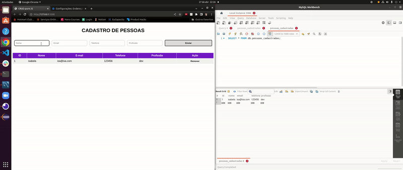

#  Projeto Cadastro de Pessoas 🗂️

## Descrição do Projeto

O projeto Cadastro de Pessoas é uma aplicação web fullstack que permite o cadastro e remoção de pessoas em um sistema. O frontend é construído em HTML, CSS e JavaScript, sem o uso de frameworks, e a lógica do CRUD é implementada no backend, construído em Java usando o Spring. O projeto utiliza um banco de dados SQL (como MySQL) para armazenar as informações das pessoas, e para realização de testes é utilizado o H2, JUnit e Mockito. A lógica de inserção e remoção de dados é implementada utilizando JDBC e SQL puro, sem o uso de JPA ou Hibernate. A interface do usuário é amigável e fácil de usar, permitindo que o usuário cadastre e remova pessoas com facilidade e segurança.



# :rotating_light: Como utilizar
## :round_pushpin: Pré-requisitos :memo:
- `Apache Maven`
- `Java 11`
- `MySQL`

## Instalação do projeto localmente :computer:

- Clone o repositório
 `git@github.com:isabelarfloriano/cadastro-de-pessoas.git`.
 - Vá para a pasta backend do projeto
 `cd cadastro-de-pessoas/backend`.
 - Instale as dependências
 `mvn install`.
 - Configure o arquivo application.yml, localizado no caminho (src/main/resources), alterando os campos username e password com as suas informações locais do MySQL.
 - Realize o mesmo procedimento no arquivo DataBaseConfig.java, localizado no caminho (src/main/java/com/java/backend/config), alterando os campos correspondentes ao username e password com as mesma informações inseridas no application.yml anteriormente.
 - Certifique-se de que o MySQL está inicializado.
 - Execute o comando
 `mvn spring-boot:run`.

## :pushpin: Para testar o projeto
-   Rode o comando
`mvn test`

## :triangular_flag_on_post: Endpoints
```
GET /pessoas: lista todos as pessoas cadastrados
POST /pessoas: cadastra uma nova pessoa
DELETE /pessoas/{id}: exclui uma pessoa cadastrada pelo ID 
